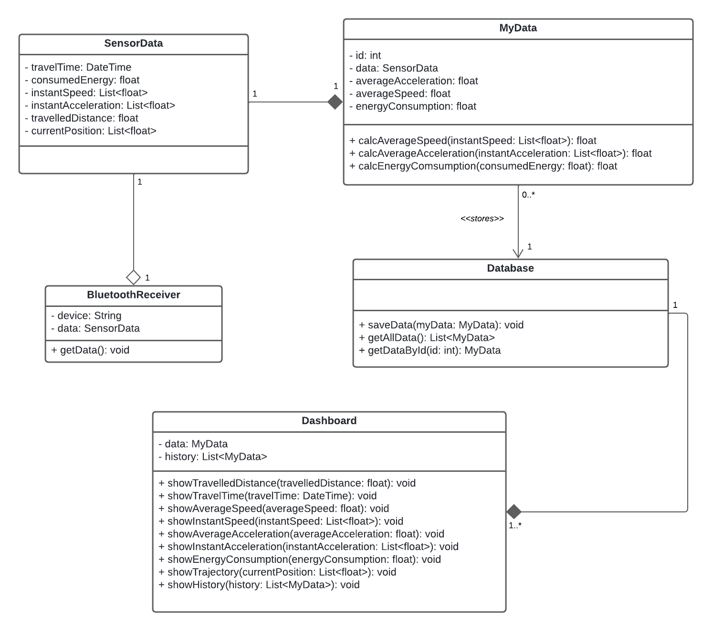

# 4. Projeto Conceitual

___________________________________________________________________________________

## 4.1 Características Gerais

O projeto visa o desenvolvimento de um carrinho seguidor de linha que percorra
três trilhas marcadas no chão, transportando um ovo de galinha ao longo desses trajetos
sem danificá-lo.  
Com o objetivo de minimizar o tempo de percurso, é necessário criar
um carrinho totalmente autônomo, equipado com todos os componentes necessários embarcados. 
O carrinho incluirá um design mecânico robusto, priorizando materiais leves e
duráveis para suportar os desafios da corrida sem comprometer a segurança do ovo. 
Além disso, o carrinho será projetado com um conjunto de sensores, capaz de interpretar os dados
dos sensores de linha e ajustar sua direção e velocidade de maneira eficiente.  
Com isso, será possível processar essas informações e mostrando os dados em tempo real em uma
aplicação web, de cada corrida.  
Um sistema de propulsão adequado será essencial para otimizar o desempenho do carrinho, 
enquanto uma fonte de energia confiável garantirá sua autonomia ao longo das trilhas. 
Combinando as áreas da engenharia e testes rigorosos, o objetivo é criar um carrinho seguidor
de linha que não apenas complete as trilhas no menor tempo possível, mas
também transporte o ovo com segurança, demonstrando a eficácia da autonomia robótica
em ambientes desafiadores.

## 4.2 Estrutura

### 4.2.1 Decisões de projeto

Foi decidido que o ideal seria o menor CAD possível, por isso foi escolhido ter duas bases, uma em cima da principal. O tamanho menor serve para ele ter mais mobilidade. O ovo e a bateria foram escolhidos para ficar na base superior, enquanto os componentes eletrônicos ficarão na base principal, embaixo. Os sensores foram colocados na frente, o mais próximo possível do chão. Serão utilizadas apenas duas rodas, pois é um sistema mais fácil e prático, onde o movimento de virar será realizado através da diferença de velocidade entre as rodas. Os materiais serão impressos em 3D, utilizando PLA. O ovo será colocado numa caixa, onde todos os lados serão protegidos com isopor e espuma, garantindo proteção suficiente, já que o carrinho apenas seguirá uma linha e não sofrerá impactos que possam quebrar o ovo.

### 4.2.2 Desenho técnico

<h6 align = "center"> Imagem 1: Desenho técnico.
  Autor: Cauan Victor Martins
 Fonte: Autor(es)</h6>

<h6 align = "center"> Imagem 2: Desenho técnico.
  Autor: Cauan Victor Martins
 Fonte: Autor(es)</h6>

<h6 align = "center"> Imagem 3: Desenho técnico.
  Autor: Cauan Victor Martins
 Fonte: Autor(es)</h6>

<h6 align = "center"> Imagem 4: Desenho técnico.
  Autor: Cauan Victor Martins
 Fonte: Autor(es)</h6>

### 4.2.3 Modelo 3D

<h6 align = "center"> Imagem 1: Modelo 3D.
  Autor: Cauan Victor Martins
 Fonte: Autor(es)</h6>

## 4.3 Descrição de hardware

### 4.3.1 Diagrama de blocos

### Observações  
 
- Pode ser utilizado qualquer formato, se atentando à posição dos [sensores infravermelhos](https://github.com/PI1-2024-1/PI1-2024-1/blob/main/Repo%20-%20Eletronica/Datasheets/TCRT5000.PDF) na parte dianteira, e dos sensores [encoder](https://github.com/PI1-2024-1/PI1-2024-1/blob/main/Repo%20-%20Eletronica/Datasheets/Encoder.pdf) que devem estar juntos aos eixos de rotação dos motores;

### 4.3.2 Lista de Materiais

| Quantidade   | Material                                           |
|---------------------|---------------------------------------------|
| 1                   | Chassi                                      |
| 1                   | Placa arduino uno R3                        |
| 4                   | Sensores Ópticos Reflexivos TCRT-5000       |
| 1                   | Módulo Bluetooth Serial Rs232 Escravo Hc-06 |
| 2                   | Sensor de velocidade módulo encoder         |
| 2                   | Discos módulo encoder                       |
| 1                   | Medidor de Corrente ACS 712 (5A)            |
| 1                   | Módulo DC-DC (LM317)                        |
| 2                   | Motores de 6V com redutor                   |
| 2                   | Rodas                                       |
| 2                   | Baterias Recarregáveis de 3.7 V 18650       |
| 4                   | Resistor 100 ohm 1/4W                       |
| 4                   | Resistor 1k ohm 1/4W                        |
| 1                   | Resistor 3k3 ohm 1/4W                       |
| 1                   | Resistor 5k ohm 1/4W                        |
| 1                   | Transistor BC547                            |
| 2                   | Diodo 1N4007                                |
| 1                   | Suporte para 2 Baterias 18650               |
| 1                   | Placa Perfurada                             |
| 2                   | Chaves/Interruptores                        |

### 4.3.3 Esquemático

<h6 align = "center"> Imagem 1: Diagrama de blocos.
 Autor: Pedro Zago
 Fonte: Autor(es)</h6>

### 4.3.4 Descrição dos componentes

Este subtópico visa descrever os componentes com uma breve justificativa de sua utilização no projeto:

#### Placa Arduino Uno R3
Optamos por utilizar a placa Arduino Uno R3 devido à sua ampla utilização em projetos de robótica simplificados e sua facilidade de uso. A vasta documentação disponível e a grande comunidade de suporte tornam esta placa ideal para iniciantes, permitindo uma curva de aprendizado mais suave e uma implementação mais eficiente.

#### Sensores Ópticos Reflexivos TCRT-5000
Os sensores ópticos reflexivos TCRT-5000 foram escolhidos para detecção de objetos e medição de distâncias curtas. Eles são ideais para sistemas de posicionamento e contagem de rotações, proporcionando precisão e confiabilidade nas medições necessárias para o controle do robô.

#### Módulo Bluetooth Serial RS232 Escravo HC-06
O módulo Bluetooth HC-06 é essencial para a transmissão dos dados de medições do Arduino via Bluetooth. Esta capacidade facilita a criação e atualização de bancos de dados, permitindo o monitoramento remoto e a análise dos dados coletados pelo robô.

#### Sensor de Velocidade Módulo Encoder
O módulo encoder, que atua como um desacoplador óptico, é crucial para calcular a distância, velocidade e aceleração de objetos em movimento. Este componente é indispensável para o monitoramento preciso do movimento do robô, garantindo um controle eficiente.

#### Discos Encoder para Medição com Módulo Encoder
Utilizamos discos encoder em conjunto com o módulo encoder para medir a rotação das rodas. Estes discos proporcionam dados precisos de movimento, essenciais para a navegação e o controle do robô, permitindo cálculos exatos de deslocamento.

#### Medidor de Corrente ACS 712
O sensor de corrente ACS 712 foi escolhido por sua simplicidade de instalação, medindo a corrente elétrica sem a necessidade de circuitos adicionais complexos. Este sensor garante a monitorização eficaz do consumo de energia do robô.

#### Regulador de Tensão LM317
O regulador de tensão LM317 ajusta a tensão de entrada de 7.4V para um nível estável de até 6V, protegendo os componentes eletrônicos do projeto. Esta regulação é essencial para a estabilidade e segurança do sistema.

#### Motores de 6V com Redutor e Rodas
Os motores de 6V com redutores são responsáveis pela movimentação do robô, oferecendo torque e controle adequados. Estes motores garantem que o robô possa se mover com precisão e eficiência.

#### Baterias Recarregáveis de 3.7V 18650
Optamos pelas baterias recarregáveis de 3.7V 18650 devido à sua alta capacidade e durabilidade. Estas baterias fornecem energia confiável ao robô, permitindo longas operações sem necessidade de recarga frequente.

#### Componentes Complementares

#### Resistores
* **Resistor 100 ohm** - Utilizados nos sensores.
* **Resistor 1k ohm** - Utilizados nos sensores.
* **Resistor 3k3 ohm** - Utilizados na comunicação.
* **Resistor 5k1 ohm** - Utilizados na comunicação.

#### Transistor e Diodo
* **Transistor BC547** - Utilizado para o controle de movimento.
* **Diodo 1N4007** - Utilizado para proteger o circuito de picos de tensão durante a operação dos motores.

#### Suporte para Baterias e Placa Perfurada
* **Suporte para 2 Baterias 18650** - Fornece suporte físico e conexões elétricas seguras para as baterias.
* **Placa Perfurada** - Utilizada para a montagem e fixação dos componentes eletrônicos.

#### Chaves/Interruptores
* **Chaves/Interruptores** - Garantem a segurança do circuito, permitindo a ligação e desligamento seguro do sistema.

## Firmware

#### Sensores TCRT-5000
Os sensores TCRT-5000 entregam tensões de 0 a 5V. É necessário calibrar uma variável que indique se o sensor está detectando a linha ou não, garantindo a precisão das leituras.

#### Módulo Bluetooth HC-06
A comunicação com o módulo Bluetooth HC-06 é realizada através da porta serial, simplificando a transmissão dos dados coletados pelo Arduino.

#### Sensores de Velocidade Módulo Encoder
Os sensores de velocidade enviam um pulso quando passam por um buraco no disco encoder, permitindo a contagem precisa das rotações.

#### Discos Encoder de 20 Furos
Cada furo do disco encoder corresponde a 3.92 mm de deslocamento, proporcionando medições detalhadas e precisas do movimento do robô.

#### Motor 6V com Redutor
O movimento do motor é controlado através de sinais PWM enviados pelas saídas definidas no esquemático, garantindo controle preciso da velocidade e direção.

#### Medidor de Corrente ACS712
O medidor de corrente ACS712 entrega uma tensão proporcional à corrente medida. Para calcular a corrente, uma variável calibrada é necessária. Correntes negativas também geram tensões positivas, exigindo uma consideração especial no cálculo.

## Software

Os dados são recebidos pelo software em forma de vetor `dados = [Enc direito; Enc esquerdo; velocidade; aceleração]`. O cálculo da posição relativa do robô é mais facilmente realizado no software do que no firmware. A cada período de comunicação, os valores do encoder são enviados, por exemplo:
* **Enc direito = 2**
* **Enc esquerdo = 4**

Isso indica que o carrinho andou uma distância em linha reta e outra para a direita, permitindo o cálculo preciso do movimento e posição do robô.

## 4.4 Análise de consumo energético

Para a análise do consumo energético do projeto foram identificados os itens eletrônicos  escolhidos para o carrinho, consultando as especificações técnicas dos componentes (corrente de operação e a tensão de funcionamento) que estão disponíveis nos datasheets de seus fabricantes, foi determinado o consumo de energia de cada peça durante sua operação. Os elementos e suas características elétricas foram listados na tabela abaixo:

<h6 align = "center"> Características elétricas dos componentes eletrônicos.</h6>

|**Componentes**|**Tensão (V)**|**Corrente (A)**|**Potência (W)**|**Quantidade**|
|:-------------:|:------------:|:---------------:|:--------------:|:------------:|
|Placa arduino uno R3                       |7,4|0,05 |0,37 |1|
|Sensores Ópticos Reflexivos TCRT-5000      |5  |0,06 |0,3  |4|
|Módulo Bluetooth Serial Rs232 Escravo Hc-06|5  |0,035|0,175|1|
|Sensor de velocidade módulo encoder        |5  |0,015|0,075|2|
|Medidor de Corrente ACS 712                |5  |0,008|0,04 |1|
|Regulador de Tensão LM 317                 |7,4|0,01 |0,074|1|
|Motores de 6V com redutor e rodas          |6  |0,2  |1,2  |2|

Multiplicou-se a corrente de operação pela tensão da fonte de alimentação, obtendo a potência de cada componente em watts (W), utilizando a fórmula:  $P = V \times i$, onde  $P$  é a potência em watts,  $V$  é a tensão em volts e  $i$  é a corrente em amperes. 

Tendo os valores das potências de cada peça, podemos saber o consumo de energia total do carrinho fazendo a soma das potências de todas as peças, com a soma obteve-se o valor de 
 $4,409$  watts. Este valor serve como uma referência importante para dimensionar a fonte de alimentação necessária e garantir um funcionamento eficiente do carrinho.

Para o cálculo da corrente requerida pelo carrinho, utilizamos a tensão de  $7,4 V$, que atende todos os componentes, e a soma das potências obtida no cálculo anterior na seguinte relação matemática:

$$P = v \times i \to i = \frac {4,409} {7,4} \simeq 0,6 A$$

Com os dados de consumo de energia total do carrinho e a capacidade da bateria, podemos calcular o tempo estimado de duração da bateria escolhida para o projeto. Estamos usando duas baterias recarregáveis 18650 de 3,7 V, totalizando 7,4 V, cada bateria tem capacidade de 2200 mAh, portanto com as duas baterias temos capacidade de 4400 mAh ( 4,4 Ah).
O tempo de duração da bateria pode ser calculado dividindo a energia total da bateria pelo consumo de energia total do carrinho: 

$$Tempo = \frac{C_{bateria}}{i} \to Tempo = \frac{4,4}{0,6} \simeq 7,3h$$

Portanto, o tempo estimado de duração da bateria para este projeto do carrinho seguidor de linha é de aproximadamente 7,3 horas. Essa é uma estimativa do tempo de operação contínua do carrinho antes que a bateria precise ser recarregada.

## 4.5 Descrição de Software
### 4.5.1 Diagrama do Processo de Negócio (BPNM)

<h6 align = "center"> Imagem 1: Diagrama de classes.
  Autor: Samuel Nogueira e Thales Duarte
 Fonte: Autor(es)</h6>

### 4.5.2 Diagrama de Classes

A imagem 2 abaixo exibe o diagrama de classes proposto para o desenvolvimento da aplicação de análise de dados. 

<h6 align = "center"> Imagem 2: Diagrama de classes.
  Autor: Brunna Louise
 Fonte: Autor(es)</h6>

### 4.5.3 Arquitetura do software

A arquitetura do software é o elemento que define a organização e a comunicação
entre as entidades a serem desenvolvidas. Por meio do esquema abaixo, é possível
visualizar os componentes e os relacionamentos entre eles em um sistema de software.

<h6 align = "center"> Imagem 3: Diagrama da arquitetura.
  Autor: Gabriel Avelino
 Fonte: Autor(es)</h6>

Os componentes podem ser divididos em:

- **Front-end**: O ViteJs é um framework utilizado para criação de aplicações WEB de maneira ágil. Vai ser o responsável por mostrar
os dados no dashboard para o usuário.

- **Back-end**: Vai ser construído utilizando o web framework FastAPI para a manipulação dos dados e o banco de dados PostgresSQL para a persistência
dos dados enviados pelo arduíno.

- **Comunicação bluetooth**: Um script python vai ser utilizado para conectar com o módulo bluetooth do arduíno e enviar os dados dos sensores que foram lidos para o backend.

### 4.5.4 Lista de Casos de Uso

A documentação de casos de uso fornece uma visão abrangente das diferentes interações entre usuários e sistema em um determinado contexto. A lista de casos de uso é uma parte essencial dessa documentação, pois descreve as principais funcionalidades que o sistema deve oferecer e os fluxos de eventos associados a cada uma delas.
No caso do projeto, a lista de casos de uso descreve as principais operações que o usuário pode realizar e como o sistema deve responder a essas operações, cada caso de uso é composto por um conjunto de etapas que descrevem o fluxo principal de eventos, bem como possíveis fluxos alternativos em caso de condições excepcionais.

### Exibir a Distância Percorrida

**Fluxo Principal:**

1. O usuário acessa a aplicação de análise de dados.
2. O sistema solicita os dados do carrinho seguidor de linha.
3. O sistema processa e calcula a distância percorrida.
4. O sistema exibe a distância percorrida na interface do usuário.

**Fluxo Alternativo:**

- Falha na comunicação com o carrinho:
  1. O sistema tenta acessar os dados do carrinho.
  2. O sistema não consegue se comunicar com o carrinho.
  3. O sistema exibe uma mensagem de erro informando que não foi possível obter os dados do carrinho.

### Exibir a Trajetória Percorrida

**Fluxo Principal:**

1. O usuário acessa a aplicação de análise de dados.
2. O sistema solicita os dados do carrinho seguidor de linha.
3. O sistema processa os dados e gera a trajetória percorrida.
4. O sistema exibe a trajetória percorrida na interface do usuário.

**Fluxo Alternativo:**

- Falha no processamento dos dados:
  1. O sistema tenta processar os dados para gerar a trajetória.
  2. O sistema detecta um erro nos dados recebidos.
  3. O sistema exibe uma mensagem de erro informando que não foi possível processar a trajetória.

### Exibir a Aceleração

**Fluxo Principal:**

1. O usuário acessa a aplicação de análise de dados.
2. O sistema solicita os dados de aceleração do carrinho seguidor de linha.
3. O sistema processa e calcula a aceleração.
4. O sistema exibe a aceleração na interface do usuário.

**Fluxo Alternativo:**

- Dados de aceleração não disponíveis:
  1. O sistema tenta acessar os dados de aceleração.
  2. O sistema verifica que os dados de aceleração não estão disponíveis.
  3. O sistema exibe uma mensagem de erro informando que os dados de aceleração não estão disponíveis.

### Exibir o Consumo de Energia

**Fluxo Principal:**

1. O usuário acessa a aplicação de análise de dados.
2. O sistema solicita os dados de consumo de energia do carrinho seguidor de linha.
3. O sistema processa e calcula o consumo de energia.
4. O sistema exibe o consumo de energia na interface do usuário.

**Fluxo Alternativo:**

- Erro no cálculo do consumo de energia:
  1. O sistema tenta processar os dados de consumo de energia.
  2. O sistema detecta um erro nos dados ou no cálculo.
  3. O sistema exibe uma mensagem de erro informando que não foi possível calcular o consumo de energia.

### Exibir a Velocidade

**Fluxo Principal:**

1. O usuário acessa a aplicação de análise de dados.
2. O sistema solicita os dados de velocidade do carrinho seguidor de linha.
3. O sistema processa e calcula a velocidade.
4. O sistema exibe a velocidade na interface do usuário.

**Fluxo Alternativo:**

- Dados de velocidade inconsistentes:
  1. O sistema tenta acessar os dados de velocidade.
  2. O sistema verifica que os dados de velocidade estão inconsistentes ou incompletos.
  3. O sistema exibe uma mensagem de erro informando que os dados de velocidade são inconsistentes.

### Exibir Histórico de Percursos

**Fluxo Principal:**

1. O usuário acessa a aplicação de análise de dados.
2. O usuário seleciona a opção para visualizar o histórico de percursos.
3. O sistema recupera o histórico de percursos do banco de dados.
4. O sistema exibe o histórico de percursos na interface do usuário.

**Fluxo Alternativo:**

- Histórico de percursos indisponível:
  1. O sistema tenta recuperar o histórico de percursos.
  2. O sistema verifica que o histórico de percursos não está disponível.
  3. O sistema exibe uma mensagem de erro informando que o histórico de percursos não pode ser exibido.

## Temas

### Cálculos dos Dados

Este tema inclui todas as features relacionadas ao processamento e cálculo dos dados do carrinho.

**Features:**

- Processamento da distância percorrida
- Cálculo da trajetória
- Cálculo da velocidade
- Cálculo da aceleração
- Cálculo do consumo de bateria

### Dashboard e Exibição

Este tema abrange todas as features relacionadas à visualização e exibição dos dados processados na interface do usuário.

**Features:**

- Exibição da distância percorrida
- Exibição da trajetória percorrida
- Exibição da velocidade em tempo real
- Exibição da aceleração em tempo real
- Exibição do consumo de bateria em tempo real
- Exibição dos dados de percursos anteriores

## Critérios de Avaliação

Os critérios de avaliação devem ser claros e verificáveis para cada User Story. Eles determinam se a User Story foi implementada corretamente.

### Exibir Trajetória Percorrida (US01)

- Deve ser exibido em um gráfico com precisão de até 1 metro.
- O gráfico deve atualizar automaticamente conforme novos dados são recebidos.
- A trajetória deve ser claramente distinguível com linhas contínuas.

### Exibir Distância Percorrida (US02)

- A distância deve ser exibida em um gráfico.
- Deve mostrar a distância total percorrida.
- O gráfico deve permitir a visualização de distâncias de percursos anteriores para comparação.

### Exibir Tempo de Percurso (US03)

- O tempo de percurso deve ser exibido em um gráfico.
- Deve mostrar o tempo total de cada percurso.
- O gráfico deve permitir a comparação do tempo de diferentes percursos.

### Exibir Velocidade em Tempo Real (US04)

- A velocidade deve ser exibida em um gráfico em tempo real.
- A atualização deve ocorrer a cada segundo.
- Deve permitir a comparação da velocidade ao longo do percurso.

### Exibir Aceleração em Tempo Real (US05)

- A aceleração deve ser exibida em um gráfico em tempo real.
- A atualização deve ocorrer a cada segundo.
- Deve permitir a comparação da aceleração ao longo do percurso.

### Exibir Consumo de Bateria em Tempo Real (US06)

- O consumo de bateria deve ser exibido em vários gráficos como um dashboard.
- Deve mostrar o consumo instantâneo e acumulado.
- O dashboard deve permitir a visualização do consumo de bateria em diferentes percursos.

### Exibir Dados de Percursos Anteriores (US07)

- Os dados de percursos anteriores devem ser exibidos em um gráfico.
- Deve permitir a seleção e comparação de múltiplos percursos.
- O gráfico deve mostrar detalhes como distância, tempo, velocidade e aceleração de percursos anteriores.

## Backlog de Casos de Uso

| Épico                  | Temas                           | Numero da US | Título da US               | Critérios                                                                                       |
|------------------------|---------------------------------|---------------|----------------------------|-------------------------------------------------------------------------------------------------|
| EP01: Gestão de dados  | Visualização de dados do percurso | US01          | Exibir Trajetória Percorrida | Deve ser exibido em um gráfico com precisão de até 1 metro. O gráfico deve atualizar automaticamente conforme novos dados são recebidos. A trajetória deve ser claramente distinguível com linhas contínuas. |
| EP01: Gestão de dados  | Visualização de dados do percurso | US02          | Exibir Distância Percorrida  | Deve ser exibido em um gráfico. Deve mostrar a distância total percorrida. O gráfico deve permitir a visualização de distâncias de percursos anteriores para comparação.                  |
| EP01: Gestão de dados  | Visualização de dados do percurso | US03          | Exibir Tempo de Percurso     | Deve ser exibido em um gráfico. Deve mostrar o tempo total de cada percurso. O gráfico deve permitir a comparação do tempo de diferentes percursos.                                            |
| EP01: Gestão de dados  | Visualização de dados do percurso | US04          | Exibir Velocidade em Tempo Real | Deve ser exibido em um gráfico em tempo real. A atualização deve ocorrer a cada segundo. Deve permitir a comparação da velocidade ao longo do percurso.                                    |
| EP01: Gestão de dados  | Visualização de dados do percurso | US05          | Exibir Aceleração em Tempo Real | Deve ser exibido em um gráfico em tempo real. A atualização deve ocorrer a cada segundo. Deve permitir a comparação da aceleração ao longo do percurso.                                     |
| EP01: Gestão de dados  | Visualização de dados do percurso | US06          | Exibir Consumo de Bateria em Tempo Real | Deve ser exibido em vários gráficos como um dashboard. Deve mostrar o consumo instantâneo e acumulado. O dashboard deve permitir a visualização do consumo de bateria em diferentes percursos. |
| EP01: Gestão de dados  | Visualização de dados do percurso | US07          | Exibir Dados de Percursos Anteriores | Deve ser exibido em um gráfico. Deve permitir a seleção e comparação de múltiplos percursos. O gráfico deve mostrar detalhes como distância, tempo, velocidade e aceleração de percursos anteriores. |

___________________________________________________________________________________

## Componentes a serem aprofundados

- Estruturas:
    - O carrinho deve ser construído com materiais leves, mas robustos,
    capazes de suportar os rigores da corrida sem comprometer a integridade do ovo. 

- Coleta e Transmissão de Dados: 
    - É fundamental garantir a transmissão de
    dados pelos sensores e exatidão na coleta de informações eficiente para o banco de dados. 
- Análise de Consumo Energético: 
    - A principal preocupação energética é o consumo da bateria que alimenta os componentes eletrônicos.  
    Esta análise busca compreender e otimizar o consumo da bateria, assegurando a operação contínua dos sensores e sistemas
    embarcados durante todo o percuso do carrinho. 
- Construção de Software: 
    - Abordará as melhores estratégias para o desenvolvi-
    mento, armazenamento e exibição dos dados coletados.

___________________________________________________________________________________

## EAP - Estrutura Analítica de Projeto

Estrutura Análitica do Projeto (EAP) é um diagrama que tem a finalidade de
organizar e decompor o escopo do projeto em pequenas partes, facilitando o entendimento
e a visualização do projeto como um todo. 
A EAP é uma ferramenta muito utilizada no gerenciamento de projetos, pois ela permite que
tenha uma visão geral do projeto, podendo assim, identificar os principais entregáveis e
as atividades necessárias para a conclusão do projeto. 
Assim, as etapas que foram definidas são: 

- Documentação: Fase que envolve a pesquisa teórica e documentação do projeto,
definindo escopo, custo e tempo. 
- Estruturas: Fase de desenvolvimento do projeto de estruturas do carrinho. Com
pesquisas teóricas, escolha de materiais e construção da estrutura do projeto. 
- Energia: Fase de desenvolvimento do projeto energético, com pesquisas teoricas
sobre consumo energético e escolha dos componentes para o consumo de energia do
carrinho. 
- Eletrônica: Fase de desenvolvimento do projeto de eletrônica, com pesquisa de sen-
sores e esquemáticos dos componentes e desenvolvimento dos códigos e calibrações
dos sensores. 
- Software: Fase de desenvolvimento do projeto de software, com criação de diagra-
mas e fluxos de usuários, bem como também o desenvolvimento da aplicação que
receberá os dados do carrinho em tempo real. 
- Integração: Etapa que corresponde a integração de todos as partes do projeto e
testes de integração para a conclusão do produto.

___________________________________________________________________________________

___________________________________________________________________________________
