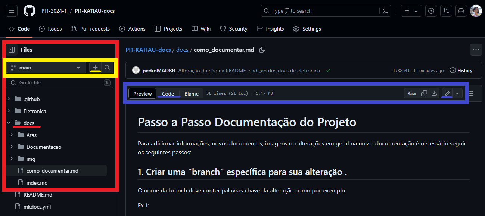

# Passo a Passo Documentação do Projeto

Para adicionar informações, novos documentos, imagens ou alterações em geral na nossa documentação é necessário seguir os seguintes passos:

## 1. Criar uma "branch" específica para sua alteração .

  O nome da branch deve conter palavras chave da alteração como por exemplo:

Ex.1: 

- Desejo adicionar a ata da reunião geral da semana passada
- O nome da branch para isso será: "AtaRG-Data"
- Em "Data" insira os números diretamente como "1505" no caso da ata ser do dia 15/05

Ex.2:

- Irei adicionar diagramas para o projeto conceitual
- O nome da branch será: "Diagrama-Tipo-Area"
- Em "Tipo" insira o tipo do diagrama que será inserido
- Em "Area" insira a área da qual pertence o diagrama

  Da mesma forma siga o padrão para outros tipos de alterações

  Na área amarela é possível identificar qual branch você está (No caso do exemplo é a main). Para trocar de branch ou criar uma nova você pode apertar na seta para baixo, selecionar a branch desejada ou escrever o nome da branch nova para ser criada no espaço de busca.

## 2. Adicione suas alterações na pasta "docs".

  Para que o site funcione é necessário adicionar as alterações seja em texto ou arquivo dentro da pasta "docs" e seguindo o padrão de criação de arquivos já existente, pois somente assim o site é compilado e exibirá tudo.

## 3. Confirme as alterações por meio de um commit ou mais de um.

  - Cada alteração em um ou vários arquivos devem ser commitadas, para garantir que o arquivo seja "salvo" no repositório do GitHub.
  - Para realizar os commits você deve:

  

    1. Na área vermelha é possível selecionar o arquivo que você irá editar
    2. Na área azul você pode apertar no botão "code" para visualizar em código e no botão do lápis para editar
    3. No código você faz suas alterações da forma que preferir

## 4. Realize um PR(Pull Request) da sua branch com a branch principal "main"
 
- Feito o(s) commit(s), deve ser feito o Pull Request para enviar para a branch "main" todas as alterações feitas.
- Segue abaixo o passo a passo para realizar o processo:

  
    1. Na área em azul, você irá entrar na aba para criação e vizualização das "Pull Requests" existentes, entre nela para dar continuidade ao processo.
    2. Na área em vermelho, 

    1. tedskfdsjf
    2. sf,saflmsa
    3. fdsfjdkfgds

    1. tedskfdsjf
    2. fdsfjdkfgds
    3. sçfsajkfnbs

- Finalmente, solicitamos que lembre de acionar revisor e solicitar revisão rapidamente.

